# Filippo Piggici: Portfolio

Personal portfolio for selected product work, frontend leadership and independent projects.

[filippopiggici.dev](https://filippopiggici.dev)

## Selected work

### Outverse: enterprise AI agent product

**Role:** Mid → Senior → Lead Frontend Engineer, 2021 to Now  
**Focus:** AI product UX, frontend platform and technical leadership

Outverse is an enterprise platform for configuring, running and understanding customer-service agents. I lead its frontend across the operational product and embedded customer widget.

The iframe-based widget and its host-page orchestration support millions of interactions in production. My work includes the conversation UI, responsive and branded presentation, localisation, bootstrap integration and the `postMessage` layer coordinating state and pointer events between the host page and iframe.

#### The design problem

An operational agent interface has to keep the customer conversation readable while progressively exposing the context needed to understand behaviour:

- retrieved RAG context and cited sources;
- policy execution, tool calls and outputs;
- requests for missing user input;
- escalation reasoning and human hand-off;
- channel, intent, metadata, review state and event history.

The interface must support investigation without making every ordinary conversation feel like a developer console.

#### Configuration and policy UX

I designed interaction patterns for authoring agent behaviour as structured product configuration rather than opaque prompts. Intent triggers define when behaviour applies; policy steps define what the agent should do; typed tools connect it to customer systems; guardrails and escalation rules make boundaries explicit.

<p align="center">
  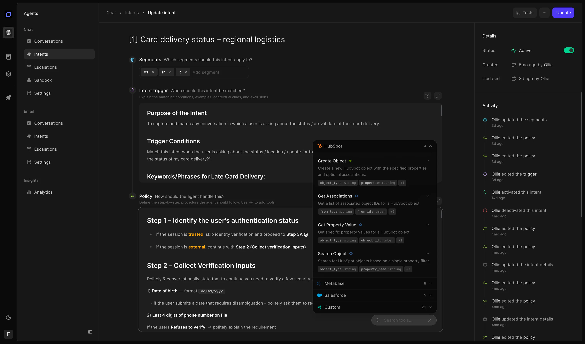
  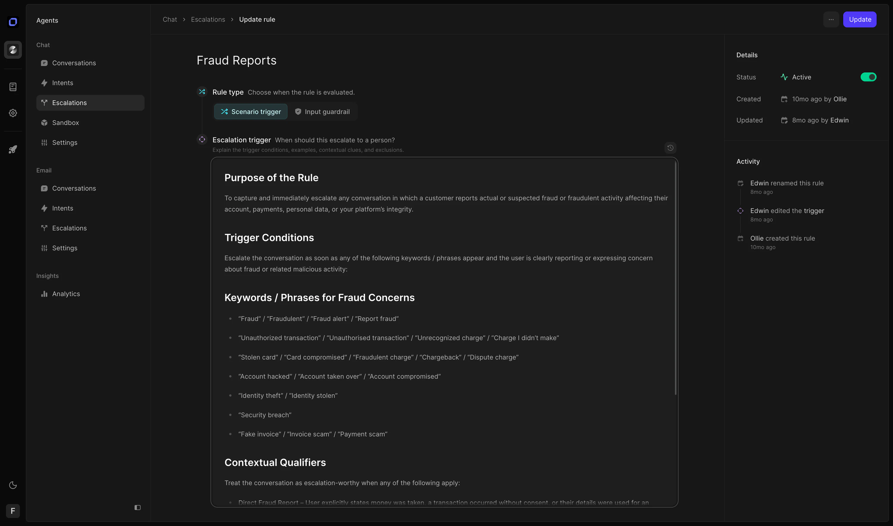
</p>
<p align="center"><sub>Intent and tool orchestration · Explicit escalation logic</sub></p>

#### Observability for agent behaviour

Conversation detail views bring together the answer, sources, retrieved context, policy reasoning, tool execution, operational metadata and human review trail. Operators get enough evidence to identify failures and improve a policy without exposing every internal token.

<p align="center">
  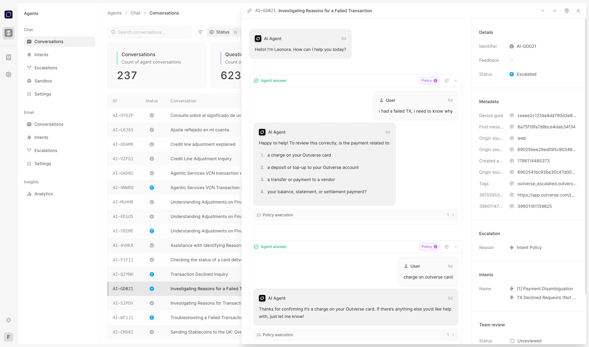
</p>
<p align="center"><sub>Conversation history with progressively disclosed policy context</sub></p>

#### Internal tooling: Widget Observatory

I built an internal observatory for testing the embedded widget as a system. It can trigger escalation, failure, processing and QA states; monitor the active pipeline and event log; and exercise the bootstrap integration across themes, viewport sizes and host-page conditions. This made intermittent `postMessage` timing and pointer-event failures repeatable before changes reached customer environments.

<table>
  <tr>
    <td width="50%" valign="top">
      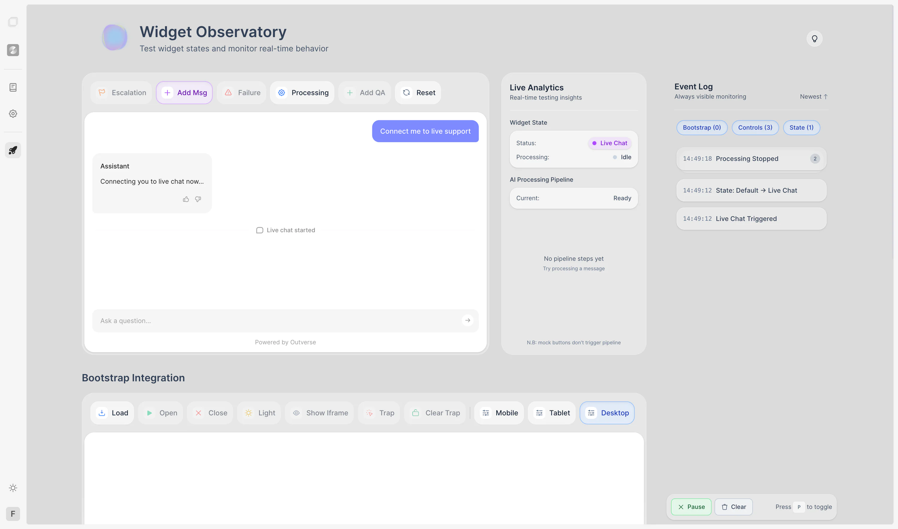
      <br /><sub>State simulation and live pipeline monitoring</sub>
    </td>
    <td width="50%" valign="top">
      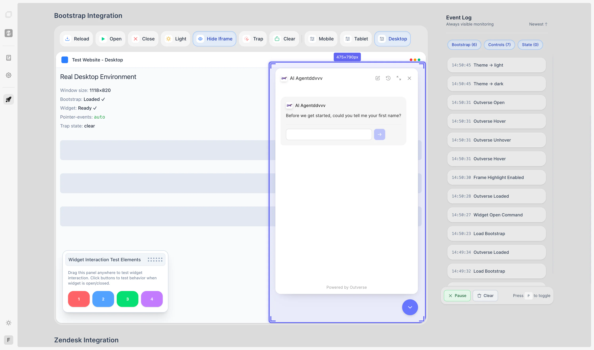
      <br /><sub>Bootstrap integration and responsive host-page testing</sub>
    </td>
  </tr>
</table>

#### Embedded widget and prototypes

The customer widget communicates retrieval, policy, progress, sources and failure states inside an unknown host page. Its ready, working and answer states adapt to each customer’s responsive constraints, branding and accessible foreground colours.

<table>
  <tr>
    <td width="33.33%" valign="top">
      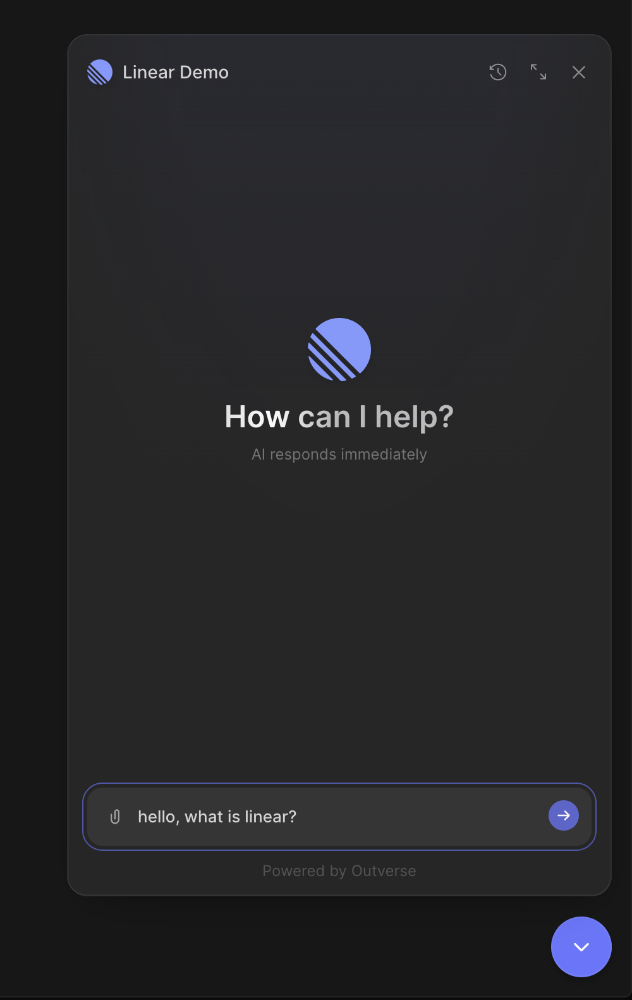
      <br /><sub>Ready</sub>
    </td>
    <td width="33.33%" valign="top">
      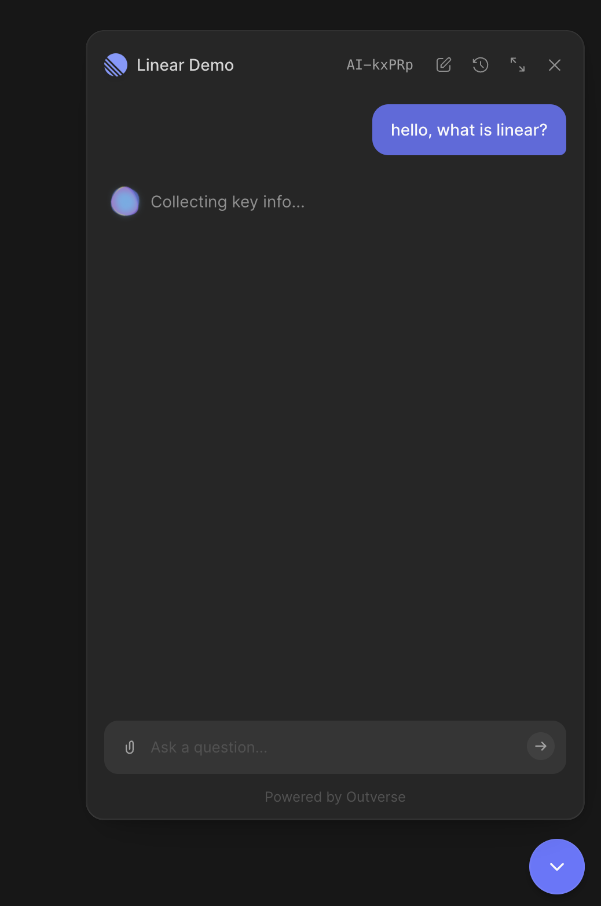
      <br /><sub>Working</sub>
    </td>
    <td width="33.33%" valign="top">
      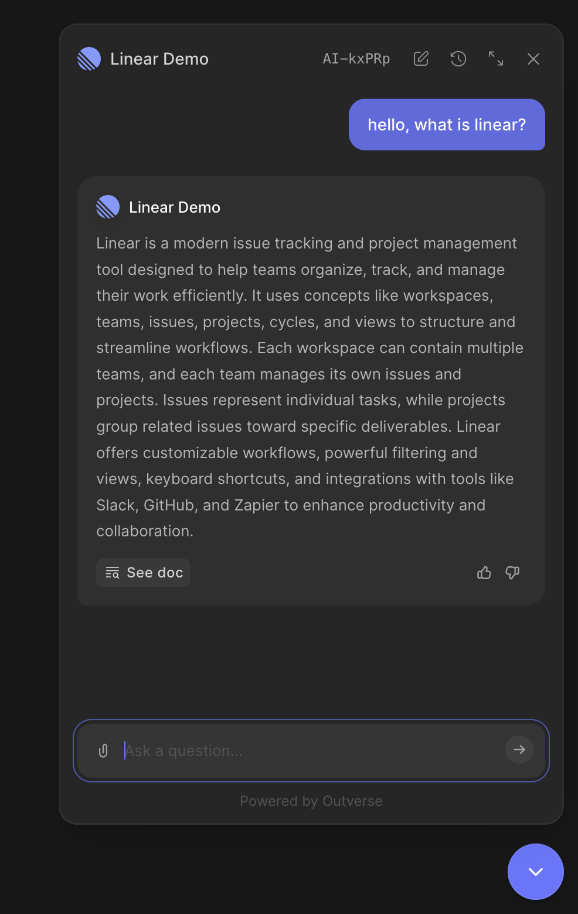
      <br /><sub>Answer with source access</sub>
    </td>
  </tr>
</table>

The voice prototype explored how spoken input could coexist with a persistent text transcript, keeping listening, speaking, interruption and mute states explicit without losing the clarity and history of text.

<a href="public/videos/outverse/voice-prototype.mp4">
  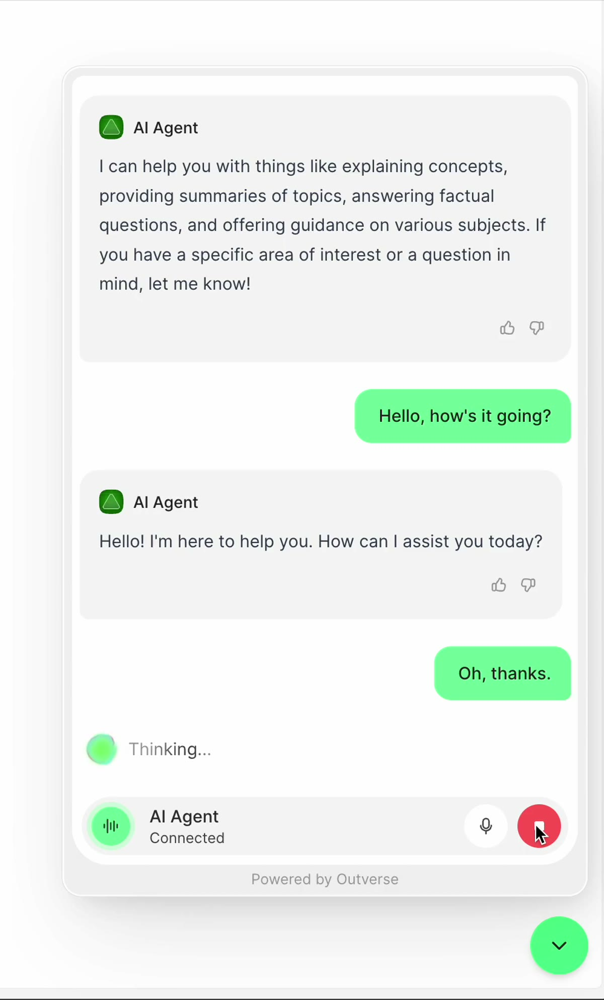
</a>
<br /><sub>▶ Play the voice interaction prototype</sub>

#### Frontend system

I separated the embedded widget from the main web app into its own deployable SvelteKit surface and introduced `@outverse/core` as their shared package, removing roughly 2.7k lines of duplicated widget implementation. I work across React, Svelte 4/5, SvelteKit, TypeScript, Tailwind, Vite and WebSockets, with Playwright, Vitest, Storybook, Chromatic and Sentry supporting quality and operational feedback.

---

### Streaming Calculator: independent creator-tools platform

**Role:** Owner and builder  
**Reach:** Approximately 20k views per month  
**Evidence:** 30+ calculator and comparison routes · approximately 800 backlinks

[Streaming Calculator](https://streamingcalculator.com) grew from a royalty calculator into a platform for musicians and creators, covering platform and country rates, reverse earnings targets, distributor costs, royalty advances, YouTube, TikTok, Twitch and editorial content.

The SvelteKit product is deployed on Cloudflare and prioritises prerendered content, technical SEO and fast, low-JavaScript interactions. Contextual sponsor and partner placements use first-party click tracking rather than a third-party advertising network.

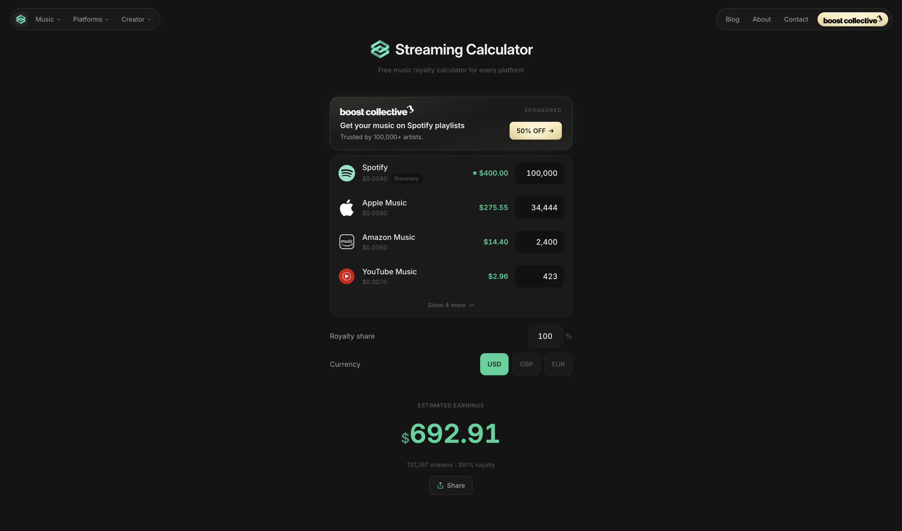

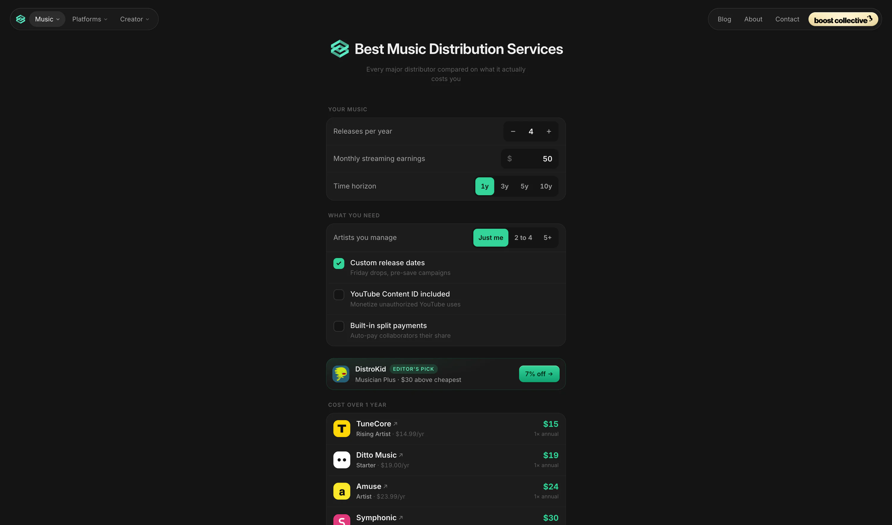

---

### Treatwell: consumer marketplace

**Role:** Frontend Software Engineer, 2019 to 2021  
**Focus:** Lookbook, venue pages, reviews, localisation and frontend quality

At Treatwell, I built consumer marketplace experiences for discovering, evaluating and booking beauty services. I was part of the small team that built Lookbook from greenfield, connecting real salon work and visual filters directly to bookable services.

I also worked across venue and review journeys in a large React and TypeScript product, shipping localised experiences with product, design and backend teams. Quality work included Cypress end-to-end and visual regression tests, Jest, Testing Library and Grafana.

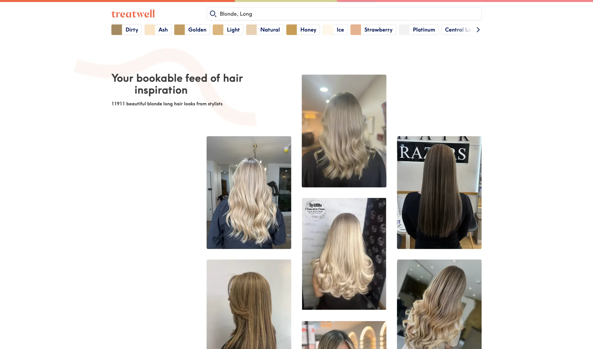

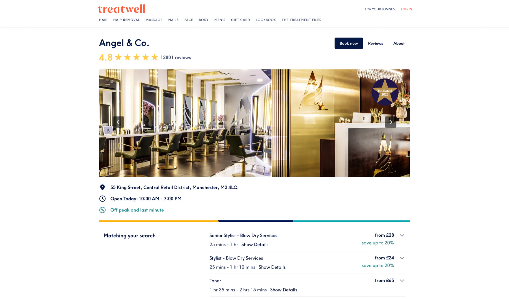

## Portfolio implementation

- Next.js 16 and React 19
- TypeScript and Tailwind CSS 4
- Cloudflare hosting, Turnstile verification and R2-hosted media
- `next/image` static imports for project media
- Resend for the contact form and receipt email
- Playwright browser tests

The custom audio player streams music released as **Moyo** from Cloudflare R2 and links to Spotify as the external listening destination.

## Development

```bash
pnpm install
pnpm dev
```

```bash
pnpm lint
pnpm typecheck
pnpm build
pnpm test:e2e
```

Production deployments use `NEXT_PUBLIC_SITE_URL`, `NEXT_PUBLIC_TURNSTILE_SITE_KEY`, `TURNSTILE_SECRET_KEY`, `RESEND_API_KEY` and `RESEND_FROM_EMAIL`. The public Turnstile site key must be available when the client bundle is built.
